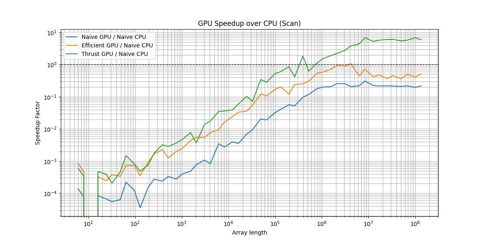
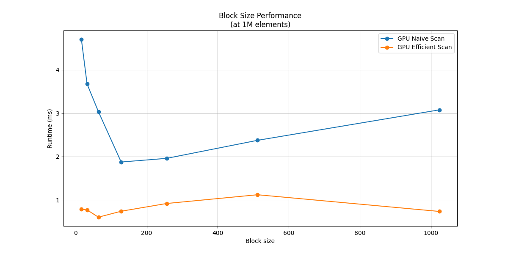
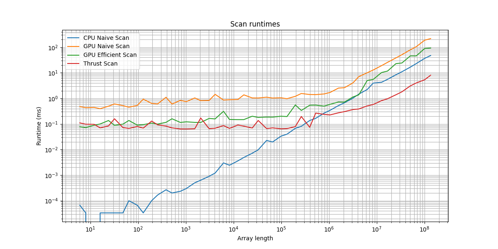
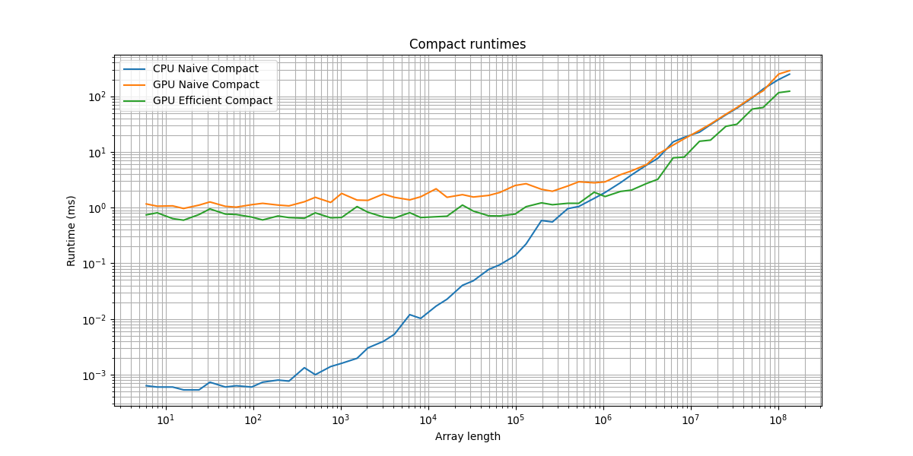
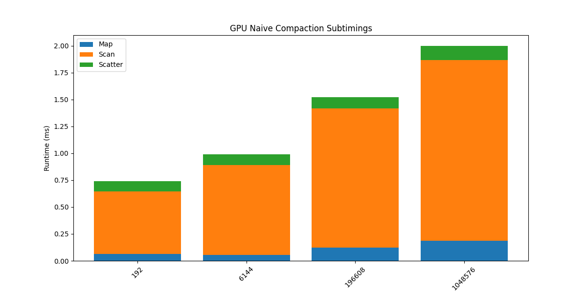
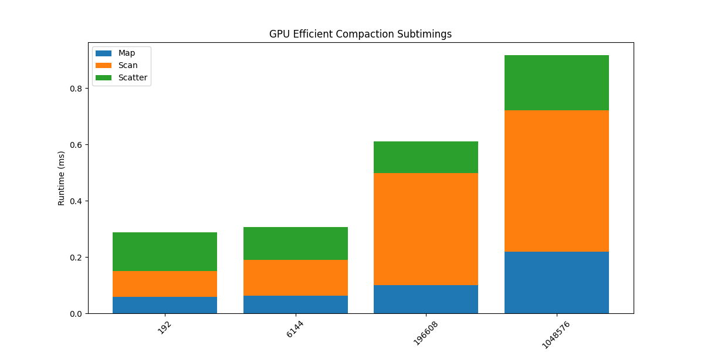
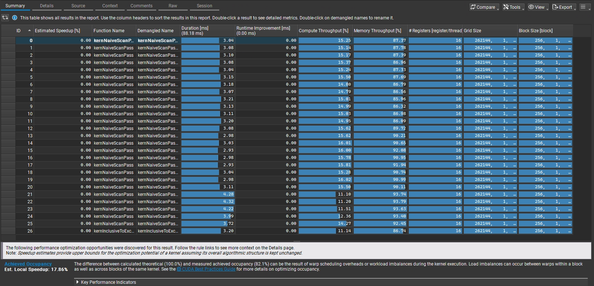
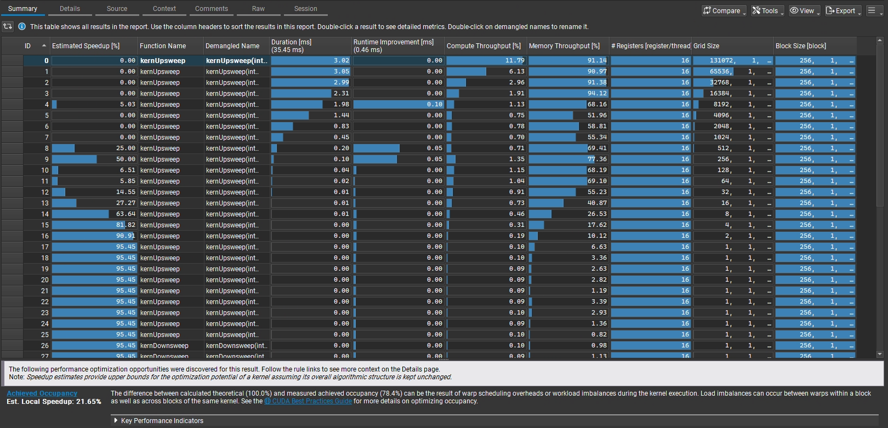
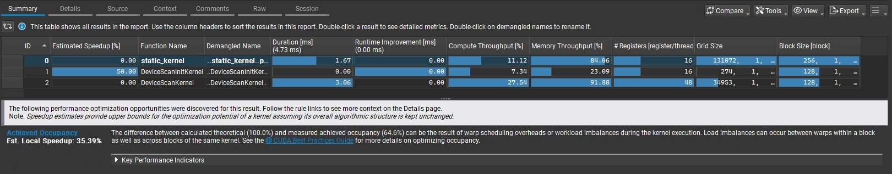

**University of Pennsylvania, CIS 5650: GPU Programming and Architecture, Project 2**

* Yannick Gachnang
  * [LinkedIn](https://www.linkedin.com/in/yannickga/)
* Tested on: Windows 10, EPYC 9354 @ 3.25GHz, 16GB RAM, RTX 2000 Ada 23GB VRAM

Project 2 Stream Compaction
====================

This project implements stream compaction in CUDA using different versions of prefix sum (scan). The implementations include a CPU baseline, a naive GPU scan, a work-efficient GPU scan with compaction, and Thrust’s built-in scan. Additionally, I implemented radix sort as an extra credit feature.

## Implementation

As per the project instruction, I implemented all the required scan and compaction variants, plus radix sort as an extension. Below is a breakdown of the different implementations and how they work.


### CPU Scan & Compaction

For the CPU side, I wrote three different functions. The scan is implemented as a simple exclusive prefix sum using a for loop. Then I added two versions of compaction: one that simply loops over the input and copies nonzero values directly, and one that mirrors the GPU algorithm by performing map → scan → scatter on the CPU. These CPU versions serve as the correctness reference for all the GPU tests.  

### Naive GPU Scan & Compaction

The naive GPU scan works by running `ilog2ceil(n)` passes where each pass adds values with a given offset. I used two buffers and swapped between them each iteration, and finally converted the inclusive result into an exclusive scan. This approach is simple but requires many kernel launches and synchronizations. I implemented stream compaction on top of this by first mapping the input into 0/1 flags, then scanning these flags, and finally scattering the surviving elements into the output array. This method avoids race conditions and works in place, but at the upper levels of the tree only a few threads remain active which means utilization goes down.  

### Work-Efficient GPU Scan & Compaction

The work-efficient GPU scan is based on Blelloch’s upsweep/downsweep algorithm. In the upsweep phase, partial sums are built in a binary tree structure, and then in the downsweep the values are propagated back down to get an exclusive scan. The compaction was implemented the same way as in the naive version, except with the scan portion swapped out.

### Thrust

Thrust’s scan is just a wrapper around `thrust::exclusive_scan` on a device vector and serves to compare my implementation against a highly optimized version of these algorithms.

### Radix Sort (Extra Credit)

Finally, for the extra credit I implemented radix sort on top of the work-efficient scan. Each digit is processed by splitting the array into buckets using map → scan → scatter, and then recombining them. Repeating this for each bit group results in a complete integer sort on the GPU.  

---

## Performance Testing

### CPU vs GPU Scaling

For this test I tested power-of-two inputs ranging from $2^3$ (8) elements up to $2^{28}$ (268435456) elements on the various scan implementations.



Naive GPU scan stays below zero everywhere. Starting at a factor somewhere around 0.0001x for small arrays and growing towards a factor of 0.2x (still 5 times slower) at $2^{20}$ elements. It levels off after that and stays relatively constant. The work-efficient scan is better than naive but it also sits below zero across the whole sweep, though it does better with a 0.51x factor towards the end of the range. Thrust starts negative at the very small sizes, crosses to positive as we scale up, and then keeps climbing. Around the mid-range its ahead of the CPU by about a factor of 1.5x and at the very end, thrust is 8.06 ms, which is roughly 5.9x faster than CPU.

<details>
  <summary>Raw Data</summary>
  

  
</details>

### Block Size Optimization

Here I tested block sizes from 16 up to 1024 threads for both the naive and efficient GPU scans at $2^{20}$ ($\approx$ 1M elements) averaged over three runs.



There is a clear optimum for the naive scan at 128 threads per block with 1.873 ms at 128 and a U-shape around it. This looks like the typical balance between getting enough work per block to hide latency and not sacrificing occupancy. For the work-efficient scan the curve is flatter but still has a clear best region around 64 threads per block with 0.602 ms at 64 and 0.739 ms at 128. It climbs for larger block sizes. At 1024 threads it recovers a bit (0.734 ms), which suggests that the resource mix at that size on this GPU happens to be in a decent occupancy regime for this kernel, but it still doesn’t beat the 64-thread sweet spot. Overall, 128 is the right choice for naive and 64–128 is the safe choice for efficient on this hardware.

<details>
  <summary>Raw Data</summary>
  

  
</details>

### Scan Runtimes

For this test I tested both power-of-two inputs and arbitrary non-power-of-two inputs ranging from $2^3$ (8) elements up to $2^{28}$ (268435456) elements on the various scan implementations.



If we look at the small end first, the CPU wins easily against all GPU implementations. By 100k elements Thrust manages to beat the CPU version and stays in the lead after that. The work-efficient scan stays well ahead of the naive scan across the entire range but never manages to outright beat either the CPU or Thrust versions. I didn't expect the CPU version to be doing so well across the board, but my AMD EPYC 9354 with 32 cores is a server grade CPU, while my 2000 series GPU is several generations old and not the most modern card anymore. In my mind this is a reasonable explanation why the CPU is doing so well.

<details>
  <summary>Raw Data</summary>
  

  
</details>

### Compaction Runtimes

Here I ran the compaction implementations over the same range of array sizes as in the scan tests, again averaging over three runs.



At small sizes the CPU version is still the best option by a big margin and both GPU versions sit in the sub-millisecond range but don’t make sense given the launch overhead. As the arrays grow, the work-efficient compaction cleanly separates from the naive version and stays lower all the way through. The crossover with the CPU happens around 1M elements where at 786,432 elements the CPU is at 1.465 ms vs efficient at 1.889 ms, but at 1048576 elements the CPU is at 1.872 ms while efficient is at 1.580 ms. The gap only keeps growing and in the end at $2^{28}$ elements the efficient version is almost twice as fast as the CPU version. The naive version however never manages to beat even the CPU version (although it comes close to it towards the end). This is likely caused by the extra passes of the naive method that add on more latency.

<details>
  <summary>Raw Data</summary>
  

  
</details>

### Compaction Subtiming

For this test I recorded the separate runtimes of map, scan and scatter during compaction at a few different array sizes.





If we compare the percentages on the naive CPU compaction, the distribution between the different steps is relatively balanced. Going from a ratio of 21% map, 36% scan and 43% scatter of the total time at the smallest displayed size to 33% map, 36% scan and 31% scatter at the largest displayed size. It seems that as the arrays get larger that map starts to take up a bigger share of the time. The naive GPU version clearly shows that the scan step is the slowest part. Going from a ratio of 8% map, 79% scan and 13% scatter of the total time at the smallest displayed size to 9% map, 84% scan and 7% scatter at the largest displayed size. The efficient GPU version also looks relatively balanced, with a ratio of 20% map, 32% scan and 48% scatter of the total time at the smallest displayed size to 24% map, 55% scan and 21% scatter of the total time at the largest size. We can see that scan increasingly grows to be the dominant factor as the arrays get larger. So the main takeaway is that on GPU, scan is where most of the time gets spent (particularly as the array size increases), while on CPU all three steps stay balanced for the most part.

<details>
  <summary>Raw Data</summary>
  

  
</details>

### Sort Runtimes

For this test I compared my GPU radix sort against `std::sort` from 16 up to $2^{22}$ (4194304) elements.


`std::sort` is faster across the entire range in my runs. At the small end it’s not even close, for example `std::sort` is 0.083 ms while radix is 11.87 ms. At the largest array size, `std::sort` is 72.95 ms compared to 86.69 ms for radix, which is much closer in performance. This doesn't surprise me too much, since my radix sort is a straightforward implementation without shared-memory tuning. Right now it’s a good demonstration that a work-efficient full sort can work, but it’s not competitive with a highly optimized sort on a server grade CPU without further optimization.

<details>
  <summary>Raw Data</summary>
  

  
</details>

---

## Analysis

Overall, the results match what I expected. The CPU is unbeatable at small sizes and only starts slowing down after about one million elements and thrust is the clear winner above that because of its optimizations with shared memory, occupancy, and memory access. But it was surprising to see that the work-efficient GPU scan didn't manage to beat the CPU scan even for very large arrays. The siutation is relatively similar for compaction and the subtiming breakdown shows that scan is the main bottleneck on GPU while map and scatter are more important on CPU. For radix sort, the GPU version scales well but doesn't yet manage to beat the CPU without further optimizations.

### Nsight Observations

To analyze why the different GPU scans behave the way they do, I ran Nsight Compute in isolation on the scan kernels with an input size of $2^{26}$.



For the naive scan, Nsight shows that every pass is heavily memory limited, with global memory bandwidth at over 85% while compute utilization hovers around 15%. Since the algorithm requires $\log_2(n)$ full passes plus an additional conversion step, the overall runtime grows with repeated bandwidth-limited kernel launches. This makes it slow even though each individual kernel launch is efficient in isolation.



The work-efficient scan reduces the total work to $O(n)$, but the upsweep and downsweep phases each launch a series of kernels whose grid size halves every level. At the deeper levels this leaves only a few blocks active and most of the GPU idle but still the same launch and synchronization overhead per kernel. This results in good utilization at the top of the tree but bad utilization near the bottom which brings down the overall performance.



Thrust only launches a couple of kernels, with the main one hitting over 90% memory throughput while avoiding the repeated global passes that slow down the custom implementations. This explains why Thrust quickly overtakes the CPU once the arrays become large, while the naive and work-efficient versions both struggle to keep up.

---

## Test output

Output from the pre-written test + a custom test comparing and validating my radix sort against `std::sort`

```
****************
** SCAN TESTS **
****************
    [  36  44  23  27   6   7  41   5  42   2  14  30  34 ...  25   0 ]
==== cpu scan, power-of-two ====
   elapsed time: 1.4204ms    (std::chrono Measured)
    [   0  36  80 103 130 136 143 184 189 231 233 247 277 ... 102713478 102713503 ]
==== cpu scan, non-power-of-two ====
   elapsed time: 1.3675ms    (std::chrono Measured)
    [   0  36  80 103 130 136 143 184 189 231 233 247 277 ... 102713409 102713440 ]
    passed
==== naive scan, power-of-two ====
   elapsed time: 7.02432ms    (CUDA Measured)
    passed
==== naive scan, non-power-of-two ====
   elapsed time: 6.96771ms    (CUDA Measured)
    passed
==== work-efficient scan, power-of-two ====
   elapsed time: 1.38426ms    (CUDA Measured)
    passed
==== work-efficient scan, non-power-of-two ====
   elapsed time: 1.35088ms    (CUDA Measured)
    passed
==== thrust scan, power-of-two ====
   elapsed time: 0.410848ms    (CUDA Measured)
    passed
==== thrust scan, non-power-of-two ====
   elapsed time: 0.387072ms    (CUDA Measured)
    passed

*****************************
** STREAM COMPACTION TESTS **
*****************************
    [   2   2   3   3   0   3   3   3   2   2   0   0   2 ...   3   0 ]
==== cpu compact without scan, power-of-two ====
   elapsed time: 8.2765ms    (std::chrono Measured)
    [   2   2   3   3   3   3   3   2   2   2   3   1   3 ...   3   3 ]
    passed
==== cpu compact without scan, non-power-of-two ====
   elapsed time: 8.8411ms    (std::chrono Measured)
    [   2   2   3   3   3   3   3   2   2   2   3   1   3 ...   1   3 ]
    passed
==== cpu compact with scan ====
   elapsed time: 14.249ms    (std::chrono Measured)
    [   2   2   3   3   3   3   3   2   2   2   3   1   3 ...   3   3 ]
    passed
==== work-efficient compact, power-of-two ====
   elapsed time: 3.45242ms    (CUDA Measured)
    passed
==== work-efficient compact, non-power-of-two ====
   elapsed time: 3.82582ms    (CUDA Measured)
    passed

*******************
** SORTING TESTS **
*******************
    [  36  44  23  27   6   7  41   5  42   2  14  30  34 ...  25  25 ]
==== cpu std::sort ====
   elapsed time: 73.1832ms    (std::chrono Measured)
    [   0   0   0   0   0   0   0   0   0   0   0   0   0 ...  49  49 ]
==== work-efficient radix sort ====
   elapsed time: 87.3332ms    (CUDA Measured)
    [   0   0   0   0   0   0   0   0   0   0   0   0   0 ...  49  49 ]
    passed
```
